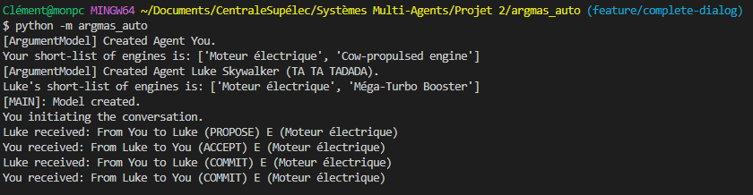

# Que faire si vous tombez en panne sur Tatooine ?

## Mise en contexte
<p align="justify">
Imaginez : vous êtes un(e) jeune Jedi parti(e) en mission de la plus haute importance sur Tatooine, planète aride et désertique située sur la bordure Extérieure. Le but de votre mission est de saboter un entrepôt de munitions de l'Empire, le régime autoritaire qui contrôle actuellement la Galaxie. Pour mener à bien votre mission, vous n'êtes pas seul(e) : votre ami et Jedi confirmé Luke Skywalker vous accompagne. Vous partagez le même vaisseau, un X-Wing biplace, et décidez de vous poser non loin de Mos Espa, la plus grande ville de la planète, où se situe l'entrepôt de l'Empire. Après une infiltration réussie, vous parvenez à vous introduire dans l'entrepôt de munitions et faites sauter le bâtiment. Il est alors temps de déguerpir : les sbires de l'Empire vous ont repérés et sont à vos trousses ! Vous vous frayez un chemin hors de la ville et regagnez votre vaisseau. C'est alors que le problème survient : au moment où vous tournez la clé de contact de votre X-Wing, le moteur ne répond plus. Par chance, vous disposez de plusieurs moteurs de rechange dans la soute du vaisseau. Luke et vous vous y rendez, et un débat a lieu entre vous pour déterminer le moteur qui vous permettra de vous sortir de ce pétrin. Attention : vous ne disposez que de peu de temps avant que les soldats de l'Empire ne vous rattrapent et vous fasses prisoniers, ce qui serait une catastrophe pour la rébellion et briserait assurément les chances de retrouver un jour paix et prospérité dans la Galaxie.
</p>
<br>
<br>


## Présentation des moteurs possibles pour votre vaisseau spatial

Dans la soute, 16 moteurs différents sont disponibles, vous ne devez en choisir qu'un.
<ul>
  - Moteur électrique<br>
  - Moteur à combustion interne Diesel<br>
  - Moteur à hadrons<br>
  - Turbo Booster<br>
  - Méga-Turbo Booster<br>
  - Moteur supra-luminique<br>
  - Cow-propulsed engine<br>
  - Faucon Millenium engine<br>
  - Mot'heure<br>
  - Hyperpropulseur ATX-5<br>
  - Hyperpropulseur AVATAR-10<br>
  - Moteur ionique P-s6<br>
  - Moteur ionique P-s7<br>
  - Moteur stellaire<br>
  - Moteur à gravité inversée<br>
  - Moteur à rhydonium
</ul>
<br>
<p align="justify">
Les moteurs sont classés selon 5 critères : coût de production, consommation, bruit, impact environnemental et durabilité.
Pour chaque critère, chaque moteur de la liste ci-dessus a un score absolu : entre 1 et 100 pour le coût de production, entre 1 et 10 pour la consommation, entre 1 et 25 pour la durabilité et l'impact environnemental et enfin entre 1 et 10 pour le bruit. Un score élevé est toujours synonyme d'une meilleure performance.
</p>

## Profil de préférences de vous et de Luke Skywalker

<p align="justify">
Avant de pouvoir argumenter, vous et Luke devez constituer vos profils de préférences respectifs (indépendants). Pour constituer votre profil de préférences, vous tirer au hasard 4 nombres entre les bornes basses et hautes des scores des critères (par exemple, entre 1 et 10 pour le critère de consommation). Vous ordonnez ces nombres, et cela définit 5 catégories (1 avant le seuil le plus bas, 1 entre chaque paire de seuils intermédiaires et 1 au-delà du seuil le plus haut). Vous pouvez ainsi donner un 5-uplets d'avis (allant de Very Bad à Very Good) pour chaque critère à chaque moteur. Le Jedi Skywalker fait de même, de manière indépendante (son tirage aléatoire est différent du vôtre, a priori).
</p>

## Initialisation pré-dialogue

<p align="justify">
D'abord, on initialise la liste des 16 moteurs possibles, décrits par leur nom (acronymes) et leur description (cf. la liste précédente). Ensuite, on crée la table (absolue, partagée par tous les agents) des scores des moteurs spatiaux selon les critères, selon les bornes minimales et maximales pré-définies. Une fois cette table créée, les agents (Luke et vous-même) êtes créés. Chaque agent génère son profil de notation pour chaque critère en tirant aléatoirement 4 nombres, dans la démarche mentionnée précédemment. Ainsi, chaque agent peut noter les moteurs selon les 5 critères pré-définis. Une notion importante est alors celle du score d'un moteur. En effet, une fois la grille d'évaluation des moteurs générées pour chaque agent en combinant scores absolus des moteurs et profils personnels de préférences, chaque agent possède la même fonction de notation qui permet de donner un score absolu aux moteurs, et ainsi de les ordonner par préférence. Cet ordonnancement est personnel car il repose sur les profils de préférences personnels. Enfin, chaque agent définit son classement personnel de l'importance relative des critères, et garde en mémoire cette liste ordonnée (une par agent).
</p>

## Démarrage du dialogue, conditions de terminaison

<p align="justify">
Avant de commencer à argumenter, vous et Luke rassemblez vos idées. Vous venez de faire toutes les démarches décrites à la section précédente. C'est toujours vous, jeune Padawan, qui commencez l'argumentation (les Jedi aussi ont de bonnes manières !). Le principe est le suivant. 
Vous sélectionnez votre moteur préféré (celui avec le plus grand score selon votre profil de notation). Vous le proposez (performatif PROPOSE) à votre compagnon Jedi, Luke. À ce stade, deux possibilités. Si le moteur que vous proposez à Luke lui convient (il fait partie de son top 10% personnel), et alors vous convenez d'utiliser ce moteur et quittez la planète au plus vite : mission accomplie. Si le moteur ne convient pas à Luke, ce dernier vous demandera les raisons qui vous ont fait choisir ce moteur (performatif ASK_WHY). Le grand Jedi s'adresse à vous : il est maintenant temps de rassembler votre savoir et d'argumenter (performatif ARGUE). Vous répondez alors à Luke avec votre meilleur argument. Ce meilleur argument est déterminé de la façon suivante. Pour le moteur proposé, vous rassemblez toutes les prémisses positives (qui supportent votre choix). Ces prémisses sont en fait les couples (critère, valeur de notation personnelle selon votre profil de préférences) pour tous les critères pour lesquels votre notation personnelle est soit Good soit Very Good. Il est alors temps d'utiliser votre liste personnelle d'ordonancement des critères d'évaluation. Parmi toutes les prémisses positives, vous sélectionnez celles relatives au critère le mieux classé dans votre ordonancement général des critères. Exemple : si vous estimez que le critère Durabilité est le plus important de tous, et qu'une prémisse positive relative à la Durabilité est disponible pour le moteur de vous avez proposé à Luke, c'est celle que vous choisirez. Si elle n'est pas disponible, vous choisirez alors le second critère dans l'ordre d'importance, tenterez de trouver une premisse positive relative à ce dernier et ainsi de suite. Finalement, vous répondez avec Luke avec votre meilleur argument.
Ce cher Luke va ensuite recevoir votre argument, l'étudier avec attention (et avec son sabre laser), et va vous répondre avec deux types d'arguments possibles.
D'abord, Luke va rassembler tous les critères préférables au vôtre (de son point de vue, uniquement valable pour lui) pour lesquels votre moteur n'est pas bon (soit Bad, soit Very Bad). Ensuite, il va aussi étudier les contre-propositions qui pourraient qu'il pourrait vous faire, pour tenter de vous convaincre en retour. Ainsi, il va tenter de trouver un moteur qu'il préfère (plus haut que le vôtre dans son ordre de préférences) pour lequel la valeur du critère de votre argument est au moins aussi bonne. Finalement, Luke va vous renvoyer au hasard un argument qui appartiendra à l'un ou l'autre des types d'arguments. Quand vous recevez l'argument de Luke, vous prendrez la même démarche que lui : accepter si vous êtes d'accord pour le nouveau moteur, ou contre-attaquer (mais sans sabre laser cette fois !) avec un nouvel argument.
Le débat se termine quand quelqu'un accepte le moteur proposé par l'autre ou quand vous êtes à court d'arguments (et alors les soldats de l'Empire vous attraperont et vous condamneront aux travaux forcés sur Tatooine pendant 3 cycles solaires).
</p>

## Lancement du code

Pour utiliser le projet, il faut commencer par cloner le présent dépôt en local sur votre machine. Pour cela, lancer la commande : 
```bash
git clone https://github.com/bclement1/argmas_auto
```
Ensuite, il faut vous placer dans le dossier principal (vous serez ainsi à la racine du dépôt) : 
```bash
cd argmas_auto
```
À ce stade, vous pouvez lancer la commande suivante :
```bash
ls -l
```
Vous devriez alors voir les fichiers suivants : la licence, le fichier `.gitignore`, le dossier `images/` contenant les images du README, le dossier `instructions/` contenant le sujet du projet au format `.pdf`, un dossier `tests/` et le dossier principal, `argmas_auto/`. Ce dernier contient l'exécutable, `__main__.py`, à partir duquel vous allez pouvoir lancer le projet.
Il est désormais temps d'installer les dépendances, lancer simplement :
```bash
pip install .
```
Enfin, pour lancer le dialogue entre nos deux agents, il faut se placer à la racine du projet Git (si vous avez suivi les étapes précédentes, vous vous y trouvez déjà) et lancer la commande suivante (sans `/` à la fin de `argmas_auto`) :
```bash 
python -m argmax_auto
```
Vous devriez alors voir apparaître un dialogue entre vous-même et Luke dans le terminal. Ce dialogue contient une part d'aléatoire. Ainsi, si c'est toujours vous qui commencez le dialogue, vous ne verrez pas les mêmes arguments ou les mêmes moteurs dans le débat entre deux lancements.

## Exemples de dialogues générés

Vous trouvez ci-dessous un exemple de dialogue entre vous et Luke dans le cas où vous tombez tous deux d'accord sur le moteur à utiliser sans argumentation (cas où vos listes de moteurs favoris ont des éléments en commun) :
<br>
<br>



## Améliorations futures

Les améliorations présentées dans cette partie ont soit été réalisées (), soit auraient été réalisées avec plus de temps.

- Mettre en place un troisième Agent : la princesse Leïa. La princesse a également un profil de préférence indépendant et les trois agents débatent deux à deux pour se mettre d'accord sur le moteur à utiliser.
- Intégrer une partie d'interactif dans le projet : demander à l'utilisateur de donner son propre ordre des critères et son propre profil de préférences afin de pouvoir générer le dialogue optimale du point de vue de l'utilisateur.
