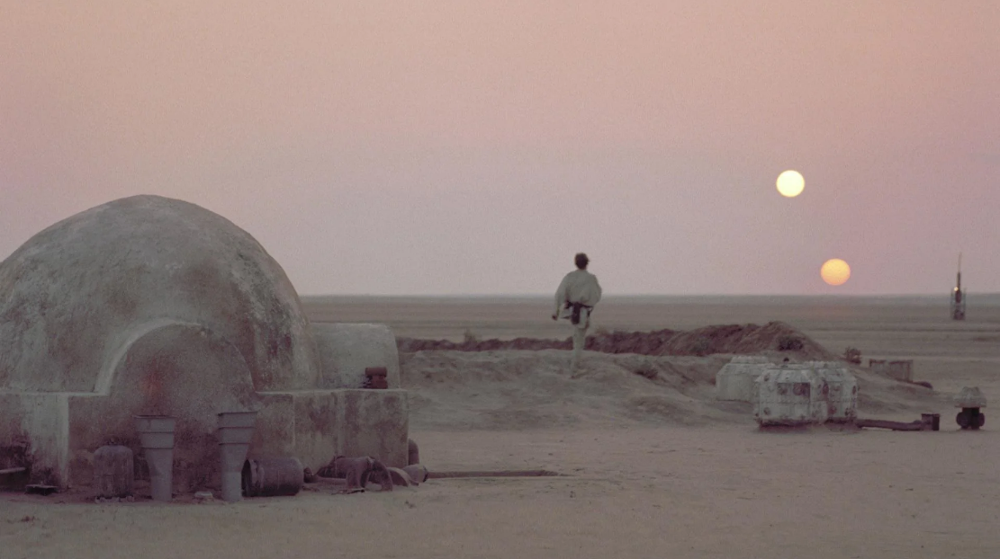

# Que faire si vous tombez en panne sur Tatooine ?

## Mise en contexte

Imaginez : vous êtes un(e) jeune Jedi parti(e) en mission de la plus haute importance sur Tatooine, planète aride et désertique située sur la bordure Extérieure. Le but de votre mission est de saboter un entrepôt de munitions de l'Empire, le régime autoritaire qui contrôle actuellement la Galaxie. Pour mener à bien votre mission, vous n'êtes pas seul(e) : votre ami et Jedi confirmé Luke Skywalker vous accompagne. Vous partagez le même vaisseau, un X-Wing biplace, et décidez de vous poser non loin de Mos Espa, la plus grande ville de la planète, où se trouve l'entrepôt de l'Empire. Après une infiltration réussie, vous parvenez à vous introduire dans l'entrepôt de munition et faites sauter le bâtiment. Il est alors temps de déguerpir : les sbires de l'Empire vous ont repérés et sont à vos trousses ! Vous vous frayez un chemin hors de la ville et regagnez votre vaisseau. C'est alors que le problème survient : au moment où vous tournez la clé de contact de votre X-Wing, le moteur ne répond plus. Par chance, vous disposez de plusieurs moteurs de rechange dans la soute du vaisseau. Luke et vous vous y rendez, et un débat a lieu entre vous pour déterminer le moteur qui vous permettra de vous sortir de ce pétrin. Attention : vous ne disposez que de peu de temps avant que les soldats de l'Empire ne vous rattrapent et vous fasses prisoniers, ce qui serait une catastrophe pour la rébellion et briserait assurément les chances de retrouver un jour paix et prospérité dans la Galaxie.

 
 

## Présentation des moteurs possibles pour votre vaisseau spatial

Dans la soute, 16 moteurs différents sont disponibles, vous ne devez en choisir qu'un.
<ul>
  - Moteur électrique 
  - Moteur à combustion interne Diesel 
  - Moteur à hadrons 
  - Turbo Booster 
  - Méga-Turbo Booster 
  - Moteur supra-luminique 
  - Cow-propulsed engine 
  - Faucon Millenium engine 
  - Mot'heure 
  - Hyperpropulseur ATX-5 
  - Hyperpropulseur AVATAR-10 
  - Moteur ionique P-s6 
  - Moteur ionique P-s7 
  - Moteur stellaire 
  - Moteur à gravité inversée 
  - Moteur à rhydonium
</ul>
 
Les moteurs sont classés selon 5 critères : coût de production, consommation, bruit, impact environnemental et durabilité.
Pour chaque critère, chaque moteur de la liste ci-dessus a un score absolu : entre 1 et 100 pour le coût de production, entre 1 et 10 pour la consommation, entre 1 et 25 pour la durabilité et l'impact environnemental et enfin entre 1 et 10 pour le bruit. Un score élevé est toujours synonyme d'une meilleure performance.

## Profil de préférences de vous et de Luke Skywalker

Pour constituer votre profil de préférences, vous tirer au hasard 4 nombres entre les bornes basses et hautes des scores des critères. Vous ordonnez ces nombres, et cela définit 5 catégories (1 avant le seuil le plus bas, 1 entre chaque paire de seuils intermédiaires et 1 au-delà du seuil le plus haut). Vous pouvez ainsi donner un 5-uplets d'avis (allant de Very Bad à Very Good) pour chaque critère à chaque moteur. Le Jedi Skywalker fait de même, de manière indépendante (son tirage aléatoire est différent du vôtre, a priori).

## Initialisation pré-dialogue

Avant de commencer à argumenter, vous et Luke rassemblez vos idées.

## Démarrage du dialogue, conditions de terminaison

C'est toujours vous, jeune Padawan qui commencez l'argumentation (les Jedi aussi ont de bonnes manières !). Le principe est le suivant : 

## Améliorations futures

Les améliorations présentées dans cette partie ont soit été réalisées (), soit auraient été réalisées avec plus de temps.

- Mettre en place un troisième Agent : la princesse Leïa. La princesse a également un profil de préférence indépendant et les trois agents débatent deux à deux pour se mettre d'accord sur le moteur à utiliser.
